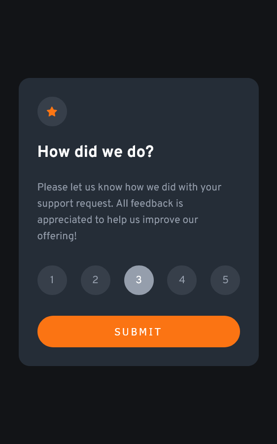
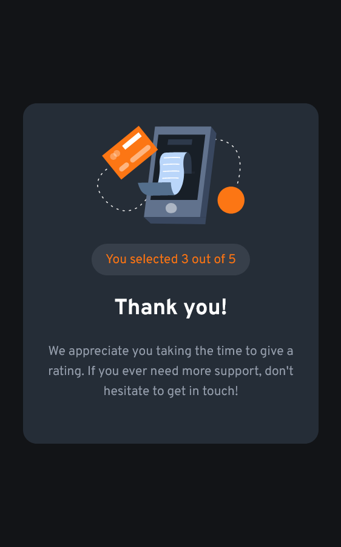

# Frontend Mentor - Interactive rating component

This is a solution to the [Interactive rating component challenge on Frontend Mentor](https://www.frontendmentor.io/challenges/interactive-rating-component-koxpeBUmI). Frontend Mentor challenges help you improve your coding skills by building realistic projects. 

## Table of contents

- [Overview](#overview)
  - [The challenge](#the-challenge)
  - [Screenshot](#screenshot)
  - [Links](#links)
- [My process](#my-process)
  - [Built with](#built-with)
  - [What I learned](#what-i-learned)
  - [Continued development](#continued-development)
  - [Useful resources](#useful-resources)
- [Author](#author)
- [Acknowledgments](#acknowledgments)

## Overview

### The challenge

Users should be able to:

- View the optimal layout for the app depending on their device's screen size (Responsive Web Design)
- See hover states for all interactive elements on the page
- Select and submit a number rating
- See the "Thank you" card state after submitting a rating

### Screenshot

 

### Links

- Live Site URL: https://jakub1710.github.io/Interactive-rating-component/

## My process

### Built with

- Semantic HTML5 markup
- SCSS
- Flexbox
- JavaScript
- Mobile-first and Responsive Web Design (RWD)

### What I learned

I learned using forEach and implement "e.target", what it was neccesery in this project. See below:

```js
const rating = (e) => {
	liItems.forEach((item) => {
		item.classList.remove('active');
		e.target.classList.add('active');
	});

	stars = e.target.textContent;
	spanChosen.innerHTML = stars;
};
```
## Author

- Frontend Mentor - [@jakub1710](https://www.frontendmentor.io/profile/jakub1710)
- LinkedIn - [@jakub](https://www.linkedin.com/in/jakub-kucia-01aa10224/)
